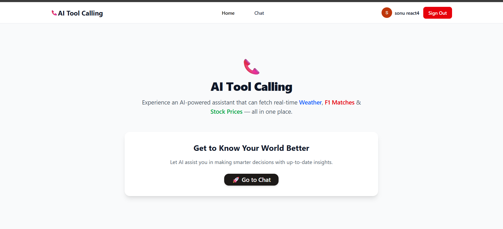

# AI-Tool-Calling

An AI-powered chat assistant that connects with real-world tools and delivers information in a conversational way.  
The project demonstrates how to combine **Next.js App Router**, **Supabase**, and **Vercel AI SDK** to build a modern, cloud-native application with authentication, data persistence, and dynamic AI integration.

---

## 🚀 Features
- **OAuth Authentication** — Login with Google or GitHub using NextAuth.js  
- **Protected Chat Interface** — Only authenticated users can access the assistant  
- **AI Assistant with Tool Calling** — Powered by Gemini + Vercel AI SDK  
  - `getWeather` → Fetches live weather data (OpenWeatherMap)  
  - `getF1Matches` → Shows upcoming F1 race details (OpenF1 API)  
  - `getStockPrice` → Returns stock price info (Alpha Vantage)  
- **Chat History Persistence** — Conversations are stored in Supabase and restored after login  
- **Server Actions + SSR/CSR Mix** — Clean usage of Next.js capabilities  

---

## 🛠️ Tech Stack
- **Framework**: Next.js (App Router, TypeScript)  
- **Database**: Supabase + Drizzle ORM  
- **UI Components**: shadcn/ui  
- **Authentication**: NextAuth.js (Google & GitHub OAuth)  
- **AI Integration**: Vercel AI SDK + Gemini  

---

## 📸 Screenshots
<!-- main home page -->


<!-- chat interface -->


---

## 🔑 Environment Setup
Create a `.env.local` file in the root:

```env
NEXTAUTH_SECRET=your_secret
NEXTAUTH_URL=http://localhost:3000

GOOGLE_CLIENT_ID=your_google_client_id
GOOGLE_CLIENT_SECRET=your_google_client_secret

GITHUB_ID=your_github_id
GITHUB_SECRET=your_github_secret

OPENAI_API_KEY=your_openai_or_gemini_key
OPENWEATHER_API_KEY=your_openweathermap_key
ALPHAVANTAGE_API_KEY=your_alphavantage_key
SUPABASE_URL=your_supabase_url
SUPABASE_ANON_KEY=your_supabase_anon_key
